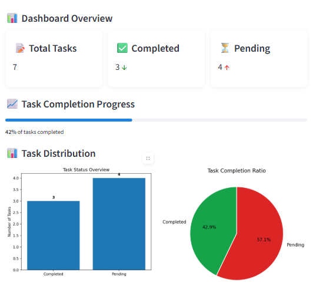
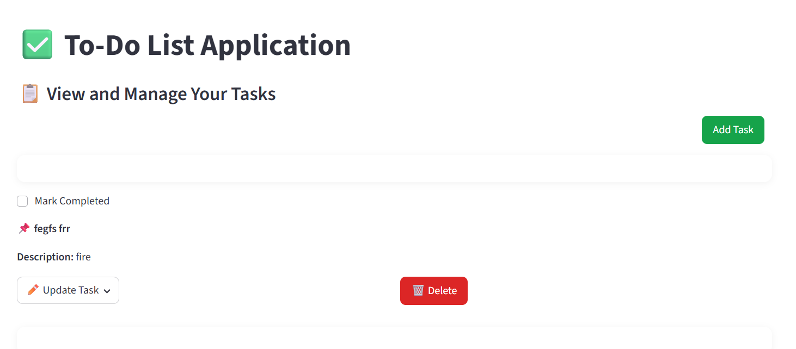

# To-Do List Project

A simple and interactive **To-Do List application** to help users manage tasks efficiently. This project allows users to **add, update, complete, and delete tasks** in a clean and organized interface.

---

## 🛠 Features

- Add new tasks with a title and optional description.
- Mark tasks as completed or pending.
- Edit or delete existing tasks.
- Responsive design (works on desktop and mobile).
- Optional: Categorize tasks or set priority (future enhancement).

---
 **Dashboard Image:**
You Can see you all task data in this dashboard of app easily

<p align="center">
  
</p>

---

## 💻 Tech Stack

- **Frontend:** streamlit 
- **Backend:**  Python  
- **Database:**  SQLite  
- **Version Control:** Git & GitHub

---


In this image you can see the image of app where you can add ,update,read and delete your task easily 




---
## 🚀 Installation & Usage

1. Clone the repository:

```bash
git clone https://github.com/Officialhuzaifa/todo_list.git
