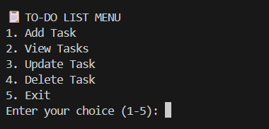

<h1 align="center">📝 To-Do List Project (CLI + Streamlit Dashboard)</h1>

<p align="center">
  <b>A simple and interactive To-Do List application built using Python.</b><br>
  Manage your tasks through a clean <b>CLI</b> or a modern <b>Streamlit Dashboard</b>.
</p>

<p align="center">
  
  
  
  
</p>

---

## 🌟 Overview

This project allows users to **add, update, complete, and delete tasks** easily — either through a **Command Line Interface (CLI)** or a **Streamlit web dashboard**.  
It’s designed for both quick task handling and a visually organized experience.

---

## 🧩 Features

✅ Add new tasks with title & description  
✅ Mark tasks as completed or pending  
✅ Edit or delete existing tasks  
✅ View all tasks in a beautiful dashboard  
✅ CLI support for quick terminal access  
✅ Responsive design — works on all screens  
✅ Future-ready for task categorization & priority  

---

## ⚙️ Tech Stack

| Layer | Technology |
|-------|-------------|
| **Frontend** | Streamlit |
| **Backend / Logic** | Python |
| **Database** | SQLite |
| **Version Control** | Git & GitHub |

---

## 📸 Screenshots

### 🖥 Dashboard View
> Easily view and manage all tasks using the Streamlit interface.

<p align="center">
  
</p>

---

### 💻 CLI Interface
> Manage tasks directly from your terminal using simple commands.

<p align="center">
  
</p>

---

### 📱 App View


---

## 🚀 Installation & Usage

### 1️⃣ Clone the repository
```bash
git clone https://github.com/Officialhuzaifa/todo_list.git
cd todo_list
```

<p align="center">

</p>